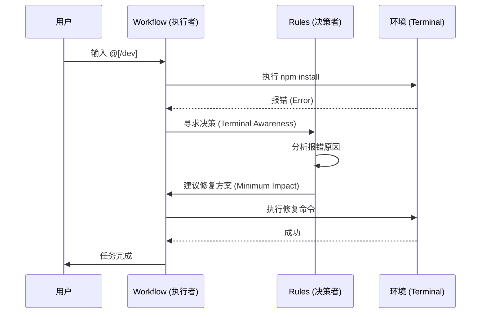
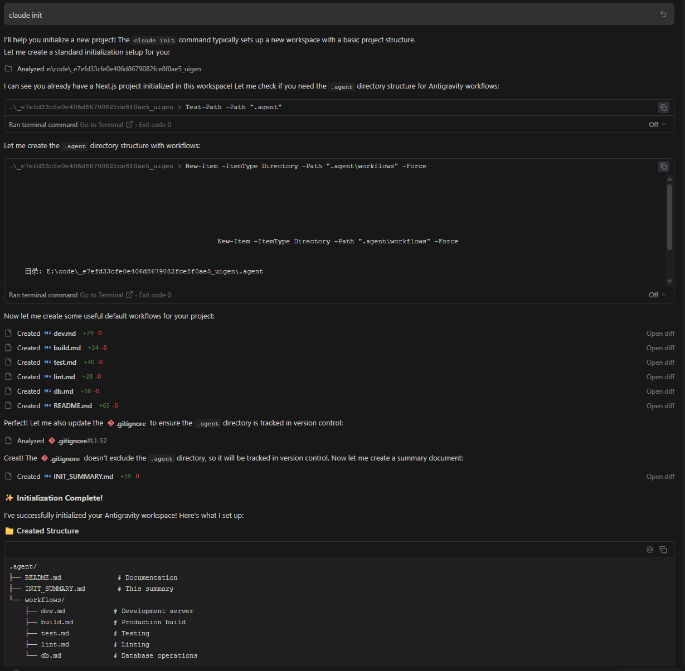

+++
title = "如何在 Antigravity 中正确使用 Rules 和 Workflow：从自动化到智能协作"
date = 2026-01-18T18:39:41+08:00
draft = false
categories = ["技术", "Antigravity"]
tags = ["Antigravity", "Rules", "Workflow", "AI Agent"]
+++

# 如何在 Antigravity 中正确使用 Rules 和 Workflow：从自动化到智能协作

在现代 AI 辅助编程中，**Antigravity** 不仅仅是一个代码补全工具，它是一个具备“感知”和“执行”能力的 AI 智能体。要发挥其最大威力，核心在于理解并配置好两大法宝：**Rules（规则）** 和 **Workflow（工作流）**。

如果说 Rules 是 AI 的“大脑和性格”，决定了它如何思考；那么 Workflow 就是 AI 的“双手”，决定了它如何高效执行。

---

## 一、 Rules：定义 AI 的“行为准则”

Rules 决定了 AI 在面对复杂任务时的决策逻辑。在 Antigravity 中，规则通常存储在 `~/.gemini/GEMINI.md`（全局）或项目根目录（局部）中。

### 1. 核心观点：从“猜测”转向“确认”

优秀的 Rules 应该强制 AI 减少幻觉，增加确定性。

**代码示例（来自您的全局配置）：**

```markdown
## 1. 任务执行习惯 (Execution Preferences)

- **Think First**: 在执行任何复杂重构前，必须先输出一个简短的 [Plan]。
- **Search Before Guessing**: 严禁猜测项目内部 API。优先使用全局搜索或跳转到定义进行确认。
- **Terminal Awareness**: 执行命令报错后，自动读取终端输出并尝试修复，直到成功。
```

### 2. 实战意义

- **Think First**：防止 AI 盲目修改代码导致项目崩溃。
- **Terminal Awareness**：这是最强大的规则。在我们的对话中，当 `npm install` 因为 Prisma 脚本报错时，AI 正是基于这一规则，没有向用户抱怨，而是自动尝试了 `npm install --ignore-scripts` 并手动执行 `prisma generate`，最终解决了问题。

---

我的global_rules 内容如下：

```markdown
# Antigravity Global Rules

## 1. 任务执行习惯 (Execution Preferences)

- **Think First**: 在执行任何复杂重构或跨文件修改前，必须先输出一个简短的 [Plan]，列出将要执行的步骤和受影响的文件。
- **Search Before Guessing**: 严禁猜测项目内部 API 的定义。如果遇到未知的函数或组件，请优先使用全局搜索或跳转到定义进行确认。
- **Terminal Awareness**: 执行命令后如果报错，请自动读取终端输出并尝试修复，直到任务成功或需要用户介入。
- **Context Pruning**: 养成“只看相关代码”的习惯。在处理特定模块时，主动忽略无关逻辑，以提升推理准确度并节省 Token。
- **Visual Thinking**: 在解释复杂逻辑、系统架构或工作流时，必须优先使用 Mermaid 图表进行视觉化输出。

## 2. 代码质量与规范 (Code Style & Quality)

- **Minimum Impact**: 保持代码库的原始风格（如缩进、单双引号）。只修改与任务直接相关的代码行，避免不必要的全文件格式化。
- **Modern Standards**: 除非另有说明，优先使用现代语法（如 ES Modules, async/await, Python 3.10+ 特性）。
- **Type Safety**: 在 TS 项目中，严禁在没有解释的情况下使用 `any` 类型。必须定义接口或类型以保持代码严谨。

## 3. 安全与边界 (Safety & Constraints)

- **Protected Files**: 禁止修改 `.env`, `package-lock.json`, `pnpm-lock.yaml`, 或任何密钥文件，除非任务目标明确要求。
- **Data Privacy**: 不要将包含敏感个人信息或生产环境密钥的代码块发送到模型进行分析。
- **Dry Run**: 对于涉及 `rm -rf` 或危险的数据库操作，必须先在终端打印出完整命令并等待我的手动确认。

## 4. IDE 协作特性 (IDE Specifics)

- **Active Focus**: 优先处理当前编辑器中处于活动状态（Focus）的文件。
- **Auto-Validate**: 修改完成后，请主动查看 IDE 的错误提示（Linter Errors）。如果有新增红线，请立即自行修正。
- **Definition of Done**: 任何修改后必须运行项目相关的验证脚本（如 `npm run lint`, `npm test` 或 `hugo`），确保代码不仅“写对了”，而且“运行对了”。
- **Project Memory (SKILL.md)**: 当解决了一个极其隐蔽的 Bug 或实现了复杂的逻辑后，必须将解决方案或核心知识点记录在 `.agent/SKILL.md` 中，为项目建立长期记忆。
- **Document Sync**: 如果修改了核心业务逻辑，请检查是否有对应的 README 需要同步更新。
```

## 二、 Workflow：构建“一键式”执行方案

Workflow 是预定义的一系列步骤，存储在 `.agent/workflows/` 目录下的 Markdown 文件中。它将复杂的开发流程标准化。

### 1. 核心观点：利用 `// turbo` 实现无人值守自动化

Workflow 的精髓在于 `// turbo` 标记，它允许 AI 在不需要用户逐步确认的情况下连续执行命令。

**代码示例（`.agent/workflows/dev.md`）：**

````markdown
---
description: Start the development server
---

# Development Server Workflow

## Steps

// turbo

1. Install dependencies

```bash
npm install
```

// turbo 2. Start the development server

```bash
npm run dev
```
````

### 2. 为什么这很重要？

- **标准化**：新成员加入项目，只需输入 `/dev` 即可完成环境配置。
- **上下文感知**：Workflow 文件本身就是文档。AI 读取这些文件后，能理解项目的构建逻辑（如：是用 `npm` 还是 `pnpm`，是否需要先启动数据库）。

---

## 三、 Rules 与 Workflow 的协同效应

当 Rules 和 Workflow 结合时，Antigravity 会从一个“指令执行器”进化为“问题解决者”。

### 协作场景模拟：

1.  **用户发起指令**：输入 `@[/dev]`。
2.  **Workflow 引导执行**：AI 开始按顺序执行 `npm install`。
3.  **遇到错误**：`npm install` 报错。
4.  **Rules 介入决策**：
    - 根据 **Terminal Awareness**，AI 分析报错原因是 postinstall 脚本失败。
    - 根据 **Minimum Impact**，AI 决定不删除 `node_modules` 重来，而是尝试绕过脚本安装。
5.  **自动修复并继续**：AI 修复问题后，继续执行 Workflow 的下一步，最终成功启动项目。

#### 协作流程图：



---

## 四、 快速上手：环境初始化

对于一个全新的项目，你不需要手动创建复杂的目录结构。

### 1. 使用 `init` 指令

如图所示，只需输入 `claude init` 或简单的 `init`。AI 会识别到当前项目没有 `.agent` 目录，并自动为您创建标准化的脚手架。



### 2. 生成的目录结构

初始化后，您的项目将获得以下“工程化套装”：

```markdown
.agent/
├── README.md # 项目 Agent 文档
├── INIT_SUMMARY.md # 初始化报告
└── workflows/ # 预定义工作流
├── dev.md # 开发服务器启动
├── build.md # 生产环境构建
├── test.md # 测试流程
├── lint.md # 代码规范检查
└── db.md # 数据库迁移操作
```

---

## 五、 最佳实践建议

1.  **保持 Workflow 原子化**：不要在一个 Workflow 里塞入太多无关任务。建议分为 `dev.md`, `build.md`, `test.md`, `db.md`。
2.  **在 Rules 中加入安全边界**：
    ```markdown
    - **Dry Run**: 涉及 `rm -rf` 或数据库删除操作，必须先打印命令并等待手动确认。
    ```
3.  **文档同步**：每当项目架构发生重大变化（例如从 Webpack 迁移到 Vite），第一时间更新 `.agent/workflows` 中的命令，确保 AI 的“技能包”始终是最新的。

---

## 五、 进阶：Agent 开发者的高级技巧

作为 Agent 开发者，如果你想让协作更进一步，可以尝试以下高级模式：

### 1. 区分“全局规则”与“项目规则”

不要把所有规则都塞进全局配置。在 `.agent/PROJECT_RULES.md` 中定义项目特有的技术栈偏好（如：强制使用 Zustand 而非 Redux），这能防止 Agent 给出“正确但在这个项目里不适用”的建议。

### 2. 引入“探索型”工作流 (`/explore`)

除了 `/dev` 和 `/build`，创建一个 `/explore` 工作流。要求 Agent 在动手前先进行 `grep` 搜索、依赖分析，并输出一份 **Impact Analysis（影响分析）**。这能极大地减少重构时的“意外惊喜”。

### 3. 建立“项目记忆” (`SKILL.md`)

当 Agent 解决了一个极其隐蔽的 Bug 后，要求它将解决方案记录在 `.agent/SKILL.md` 中。这相当于为 Agent 建立了“长期记忆”，避免它在未来的任务中重复同样的错误。

**示例模板：**

```markdown
## [2026-01-18] 修复了 Next.js 15 的 Hydration 错误

- **问题**：由于服务端和客户端渲染的时间戳不一致导致。
- **解决方案**：在组件中使用 `useEffect` 确保仅在客户端渲染特定逻辑。
- **后续注意**：所有涉及 `new Date()` 的 UI 组件必须遵循此模式。
```

### 4. 强制视觉化输出

在 Rules 中要求 Agent：“在解释复杂逻辑时，必须使用 Mermaid 图表”。一张时序图往往比 500 字的文字描述更能清晰地表达组件间的交互。

### 5. 闭环验证 (Definition of Done)

在 Rules 中强制要求 Agent：任何修改后必须运行验证脚本（如 `npm run lint` 或 `npm test`）。不要让 Agent 问你“这样行吗？”，而是让它告诉你“代码已修改，且通过了所有测试”。

### 6. 上下文剪枝 (Context Pruning)

引导 Agent 养成“只看相关代码”的习惯。在处理前端组件时，主动要求它忽略后端逻辑。这不仅能节省 Token，还能显著提升 Agent 的逻辑推理准确度。

---

## 总结

在 Antigravity 中：

- **Rules** 是为了**安全和质量**（怎么做才对）。
- **Workflow** 是为了**速度和一致性**（怎么做才快）。
- **Project Context** 是为了**灵魂和默契**（怎么做才最合适）。
- **Verification Loop** 是为了**闭环和可靠**（怎么做才算完）。

通过在 `.agent` 目录下沉淀这些资产，你实际上是在为你的项目构建一个**数字孪生开发者**。下次你只需说一句“帮我跑起来”，它就能像最默契的队友一样，处理好所有细节。
