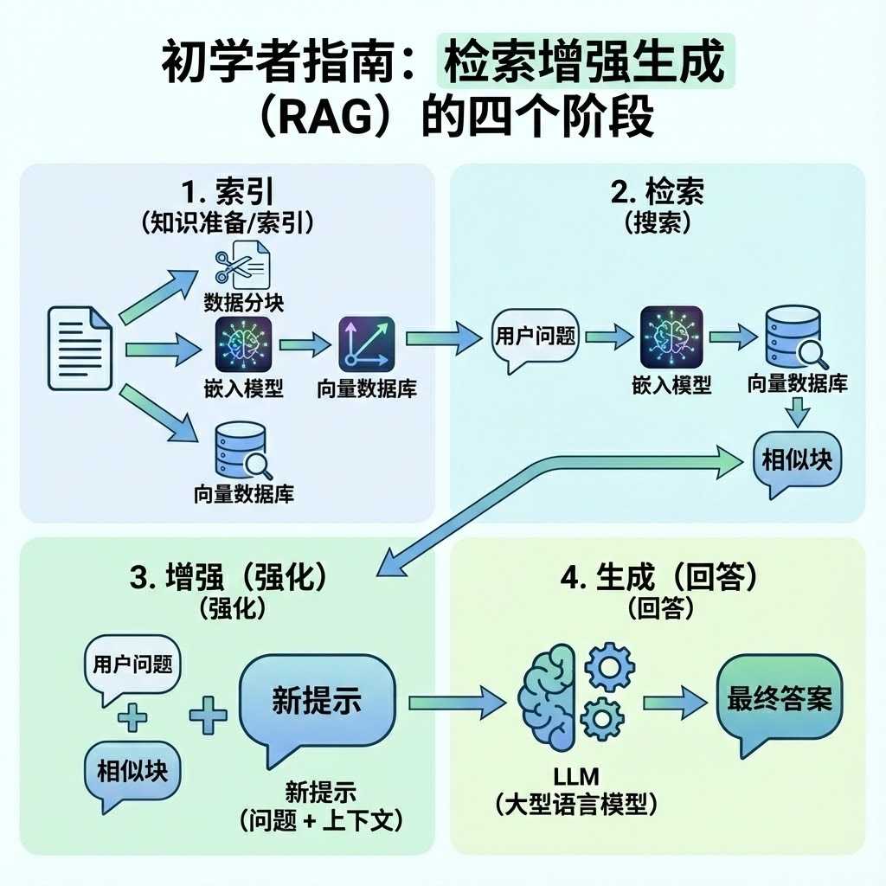
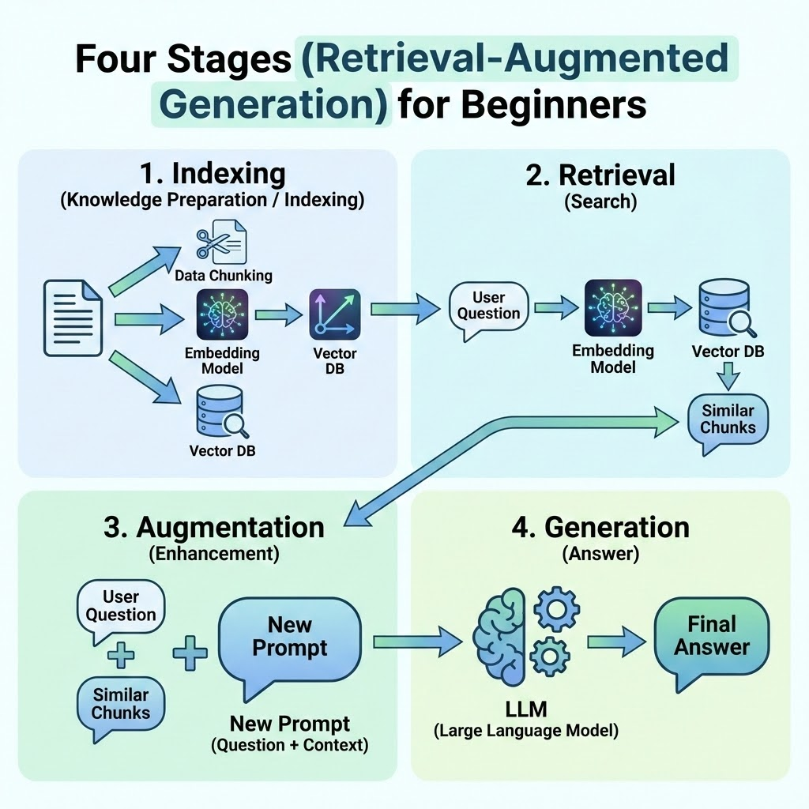

+++
title = "第六课_第二阶段理论总结（RAG 与向量数据层）"
date = 2025-12-27T00:43:00+08:00
draft = false
categories = ["技术", "AI",'智能产品架构师']
+++

我们将第二阶段关于 **RAG（检索增强生成）架构** 的理论核心整理为一份详细文档。这份文档将帮助你从架构师的角度，理解如何将非结构化数据转化为 AI 可理解的知识库 。

# ---

### **什么选择RAG**

* **痛点和解法（核心）：** 明确指出 RAG 解决的两个核心痛点：  
  1. **知识截止（Knowledge Cut-off）：** LLM 的知识是静态的，RAG 让它能学习最新信息。  
  2. **幻觉/瞎编（Hallucination）：** RAG 强制 LLM 基于提供的“上下文”（检索到的文档块）回答，大大降低错误率。  
* **经典类比：** 使用一个简单的生活化比喻（例如：把 LLM 比作一个\*\*“聪明但没读过你公司文件”**的实习生，把 RAG 比作给它配备了一个**“精准且可以快速查阅”\*\*的私人图书馆）。

### **RAG 架构端到端流程概览**

### **一、 向量嵌入：语义的数学表示 📍**

向量嵌入是将自然语言转化为高维空间坐标的过程。

* **维度与含义**：使用如 text-embedding-3-small 模型将文本映射到 1536 维空间 。每一个维度代表一个潜在的语义特征，使得“语义相近”在数学上表现为“距离相近” 。  
* **相似度度量**：在 RAG 架构中，**余弦相似度（Cosine Similarity）** 是衡量标准。  
  * **公式**：  
    $$\text{similarity} = \cos(\theta) = \frac{\mathbf{A} \cdot \mathbf{B}}{\|\mathbf{A}\| \|\mathbf{B}\|}$$

  * **核心逻辑**：它只关注向量的方向（语义一致性），而不受文本长度（向量模长）的影响，是处理长短不一文档块的最佳选择。  
* **高维分类：解决“苹果”的歧义。**在 1536 维的空间中，模型不仅仅是计算距离，它还在进行极其精细的语义分类。  
  * **多维度的力量**：OpenAI 的模型（如 `text-embedding-3-small`）将文本映射到 1536 维空间 。每一个维度都可能代表一个潜在的特征（比如“生物性”、“商业性”、“电子产品”等）。  
  * **消除歧义**：当 AI 处理“苹果”这个词时，如果上下文包含“好吃”，向量会向“水果”维度偏移；如果包含“发布会”，则向“科技公司”维度偏移 。这种在高维空间中的“自动归类”是 RAG 能够精准找回知识的基础

#### **余弦相似度（Cosine Similarity）**

**这是 AI 领域最常用的指标 。它不看点在哪里，而是看两个向量之间的夹角**

**核心逻辑：**如果两个向量指向同一个方向，夹角为 $0^\circ$，余弦值为 $1$，表示完全相关；如果相互垂直，值为 $0$，表示毫无关系。

**数学优势：**它只关注语义的方向，而不受文本长度（向量模长）的影响。这对于处理长短不一的文档块（Chunks）至关重要。

**公式解释：**

1. ##### 分子：点积（Dot Product） $\mathbf{A} \cdot \mathbf{B}$ 

这是两个向量对应位置数值相乘后的总和。

* **计算方法：**若向量$\mathbf{A} = [a_1, a_2]$，$\mathbf{B} = [b_1, b_2]$，则点积为 $a_1b_1 + a_2b_2$。。  
* **物理意义：**它反映了两个向量在方向上的重合程度。如果对应位置的数值正负一致且数值大，点积就大。

2. #####  **分母：** 模长乘积（Magnitudes） $\|\mathbf{A}\| \|\mathbf{B}\|$

这是用来做\*\*归一化（Normalization）\*\*的。

* **计算方法：**向量的模（长度） $\|\mathbf{A}\| = \sqrt{a_1^2 + a_2^2 + \dots}$。  
* **物理意义：**它消除了文本长度的影响。无论一个向量有多“长”（代表词频高或文本长），分母都会将其拉回到同一个尺度。

计算出的结果是一个介于 **\-1 到 1** 之间的数值：

* **1**：完全一致（夹角为 $0^\circ$）。  
* **0**：互不相关（夹角为 $90^\circ$）。  
* **\-1**：完全相反。

例子：

让我们用 $\mathbf{A} = [1, 1]$ 和 $\mathbf{B} = [2, 2]$  实际推导一下这个过程。

**1\. 计算分子：点积 ($\mathbf{A} \cdot \mathbf{B}$)**

我们将两个向量对应位置的数值相乘，然后求和：

$$1 \times 2 + 1 \times 2 = 2 + 2 = 4$$

**2\. 计算分母：模长的乘积($\|\mathbf{A}\| \|\mathbf{B}\|$)**

我们需要先算出每个向量的“长度”：

* **$\\mathbf{A}$ 的长度**：$\sqrt{1^2 + 1^2} = \sqrt{2}$ 
* **$\\mathbf{B}$ 的长度**：$\sqrt{2^2 + 2^2} = \sqrt{8} = 2\sqrt{2}$
* **分母结果**：$\sqrt{2} \times 2\sqrt{2} = 2 \times 2 = 4$

**3\. 代入公式得出相似度**

$$\text{similarity} = \frac{4}{4} = 1$$

通过这个推导你会发现，虽然向量 $\mathbf{B}$ 的每一项数值都是 $\mathbf{A}$ 的两倍，但公式中的分母完美地抵消了这种“长度（词频/强度）”的差异，最终只保留了**方向（语义一致性）**

### **二、 数据分块策略：知识的颗粒度管理 🧩**

为了克服 LLM 的上下文窗口限制并减少幻觉，必须对数据进行科学分块 。

* **语义分块 (Semantic Chunking)**：基于文档结构（段落、标题、Markdown）进行切分，确保每个分块语义完整 。

* **递归分块 (Recursive Splitting)**：通过层级分隔符（\\n\\n \-\> \\n \-\> .）剥洋葱式切分，最大限度保留语境。  
  * **第一级**：尝试在双换行符 `\n\n`（段落）处切分 。  
  * **第二级**：如果段落还是太长，就在单换行符 `\n` 处切分。  
  * **第三级**：如果依然超长，就在句号 `。` 或空格处切分。  
  * **第四级**：最后才考虑按字符硬切。  
      
* **重叠机制 (Overlap)**：在相邻分块间保留 10%-20% 的重复内容，防止核心上下文在切分点丢失 。  
  * **保持连贯**：这能确保即使关键信息位于切分点，检索时也能带出足够的背景 。  
  * **辅助理解**：当大模型（LLM）看到包含前后衔接的内容时，它的推理会更准确。

### **三、 向量存储与索引：检索的性能支柱 🗄️**

对于 Next.js 全栈开发者，**PostgreSQL \+ pgvector** 是构建单体数据库的首选方案 。

| 索引类型 | 核心原理 | 适用场景 |
| :---- | :---- | :---- |
| **IVFFlat** | 倒排文件索引，将空间划分为区域。（将空间划分为多个区域（簇），检索时只查最近的几个区域） | 数据量小、对构建速度要求高。 |
| **HNSW** | 分层导航小世界图，类似高速公路网络。（像社交网络一样建立多层“路标”，通过快速跳跃找到目标。） | **2025 年生产标准**。检索极快（$O(\\log n)$），支持增量构建。 |

**HNSW的优势：**

1. **增量构建 (Incremental Build) 🏗️：**  
   1. 对比：传统的 IVFFlat 需要先有数据来训练“簇”，数据变动大时还需定期重构。  
   2. 优势：HNSW 允许你从零数据开始，每增加一条笔记，它就自动把这个向量“织入”现有的图中，非常适合需要频繁更新内容的 AI 应用。  
2. **分层导航逻辑 (Expressway Analogy) 🛣️**  
   1. 它模仿了“高速公路-城市主干道-街道”的层级结构。  
   2. 顶层（稀疏层）：像高速公路，通过长跨度的连接快速跳跃到大致的目标区域。  
   3. 底层（稠密层）：像街道，在局部进行精细搜索，找到最精准的 Top-K 结果。  
   4. 这种设计让搜索复杂度降到了 $O(\\log n)$，即数据量翻 10 倍，搜索时间只增加一点点。  
      Top-K: 为了保证效率，我们通常只取出相似度分数最高的前 $K$ 个片段（例如 Top-5）。  
* **元数据过滤 (Metadata Filtering)**：在进行语义检索前，先通过 SQL（如 user\_id）过滤数据，确保多租户安全与检索效率 。 思想：**先过滤再检索**

### **四、 混合检索与排序：精度的最后防线 ⚖️**

单纯的向量检索在处理专有名词时可能失效，因此需要 **混合检索（Hybrid Search）** 。

1. **融合算法 (RRF)**：通过“倒数排名融合”合并关键词搜索（BM25）与向量搜索的结果，利用排名而非分数来提高鲁棒性。

它结合了传统关键词检索的精确性和向量检索的语义理解能力，让 RAG 系统在各种查询下都能更稳定地找到最相关的知识片段

2. **重排序 (Re-ranking)**：对初步检索出的 Top-K 结果进行深度语义二次打分，剔除噪声 。

重排序（Re-ranking）是检索增强生成（RAG）流程中的**最后一道精度防线**。它的核心思想是：对初步检索结果进行**二次深度语义分析**，以剔除“噪声”或语义相关性不高的文档块，确保发送给大语言模型（LLM）的上下文是最精准的。

以下是重排序在实际 RAG 系统中的实现原理与步骤：

1\. 核心实现原理：使用 Cross-Encoder 深度模型

与初步检索阶段常用的 \*\*Bi-Encoder（双编码器，如 `text-embedding-3-small`）\*\*不同，重排序通常采用 \*\*Cross-Encoder（交叉编码器）\*\*模型来实现：

| 特性 | Bi-Encoder（初步检索） | Cross-Encoder（重排序） |
| ----- | ----- | ----- |
| **输入** | Query 和 Document 分别编码，计算两个向量的距离。 | 将 Query 和 Document **拼接**后，一起输入模型进行一次性编码。 |
| **计算效率** | **极快**。查询时只需计算向量距离，文档编码可预先完成。 | **较慢**。每次都需要对 Query \+ Document 对进行完整的模型推理。 |
| **精度** | 适用于快速筛选的**初筛**。 | 能够捕捉 Query 和 Document 之间复杂的**细粒度交互**，**精度高**。 |
| **适用场景** | 检索整个向量数据库（百万级数据）。 | 仅对 Top-K（例如 50 个）初筛结果进行**二次打分**。 |

2\. 实施步骤（如何实现）

**第一步：初步检索（Initial Retrieval）**

* 使用向量搜索（例如 HNSW 索引配合余弦相似度）或混合检索（Hybrid Search，如 RRF）从整个数据库中快速检索出相似度最高的前 **$K$ 个**文档块（例如 $K=50$）。  
* 这一步是为了将检索范围从“百万级”缩小到“几十个”。

**第二步：构建模型输入（Input Construction）**

* 对于初步检索得到的每个文档块 $D\_i$，将其与用户查询 $Q$ 拼接成一个输入对，例如：  
  `[CLS] Q [SEP] D_i [SEP]`  
* 将这 $K$ 个拼接后的文本对分别输入到 Cross-Encoder 模型中。

**第三步：深度二次打分（Deep Re-Scoring）**

* Cross-Encoder 模型（如基于 BERT 或 T5 架构训练的 Re-ranker 模型）对每个输入对进行推理，并输出一个**新的、更精准的语义相关性分数**（通常是 0 到 1 之间的数值）。  
* 这个分数反映了 Query 和 Document 在深度语义层面上的匹配程度。

**第四步：重排序与截断（Re-sort and Truncate）**

* 根据 Cross-Encoder 提供的最新分数，对最初的 $K$ 个文档块进行**降序重新排序**。  
* 从重新排序后的列表中，选取最前面的 **$N$ 个**文档块（例如 $N=5$ 或 $N=10$，确保总长度不超过 LLM 的上下文窗口）作为最终的上下文（Context）。

3\. 常见的 Re-ranking 模型/工具

在实际开发中，可以直接使用成熟的模型库来部署 Re-ranking 模块：

* **Cohere Rerank：** 这是一个流行的 API 服务，提供高性能的重排序模型。  
* **Sentence Transformers：** 包含多种开源的 Cross-Encoder 模型（例如 `cross-encoder/ms-marco-MiniLM-L-6-v2`），可以直接用于本地部署。  
* **FlagEmbedding (BGE)：** 包含用于重排序的 BGE-Reranker 模型，在中文和英文任务上表现优异。

**总结：** Re-ranking 牺牲了少量的计算时间（因为只对 Top-K 个结果进行深度计算），换取了**巨大的精度提升**，是构建高质量 RAG 系统的关键一步。

### **五、 部署范式：云端 vs 本地 WebGPU 🖥️**

* **WebGPU/WebLLM**：利用浏览器端的 GPU 算力进行本地嵌入生成。  
  * **优势**：零边际成本、极致隐私保护 。

  * **挑战**：需要处理首屏模型下载的 UX 体验（如进度条设计，因为第一次需要下载300M-500M）。  
* **云端 API (DeepSeek/OpenAI)**：高性能、高普适性，但存在 Token 成本和隐私合规考量 。

---

这份文档涵盖了我们过去几天深入探讨的所有核心概念。有了这些理论支撑，我们就可以开始考虑如何将这些逻辑编写进 my-ai-arch 项目中了。

### **六、 总结**

| 核心阶段/概念 | 文档覆盖内容 | 评估 |
| ----- | ----- | ----- |
| **1\. 向量嵌入 (Embedding)** | 1536 维空间、text-embedding-3-small 模型、**余弦相似度 (Cosine Similarity)** 公式与核心逻辑、**高维分类**消除歧义。 | **极好**：不仅定义了概念，还深入到数学原理和实际应用（如消除“苹果”歧义）。 |
| **2\. 数据分块 (Chunking)** | **语义分块 (Semantic Chunking)**、**递归分块 (Recursive Splitting)**（多级分隔符）、**重叠机制 (Overlap)**（10%-20%）。 | **极好**：覆盖了确保语境连贯性的所有关键策略。 |
| **3\. 向量存储与索引 (Vector Indexing)** | 推荐 **PostgreSQL \+ pgvector** 方案、详细对比 **IVFFlat** 与 **HNSW**。突出 **HNSW** 的优势（**增量构建**、$O(\\log n)$ 搜索复杂度）。 | **极好**：对标 2025 年生产标准，强调了高性能索引和分层导航逻辑。 |
| **4\. 检索优化 (Retrieval Optimization)** | **元数据过滤 (Metadata Filtering)**（先过滤再检索）、**Top-K** 选取。 | **优秀**：覆盖了多租户安全和检索效率的关键手段。 |
| **5\. 精度优化 (Precision Enhancement)** | **混合检索 (Hybrid Search)**、**倒数排名融合 (RRF)**。 | **优秀**：解决了单纯向量检索在处理专有名词时的痛点。 |
| **6\. 最终精度防线 (Re-ranking)** | **重排序 (Re-ranking)** 机制、**Cross-Encoder** 与 **Bi-Encoder** 对比、详细的四步实施步骤（二次打分）、常见模型（Cohere Rerank, BGE）。 | **极好**：详细解释了 RAG 中提升最终精度的关键技术。 |
| **7\. 部署考量 (Deployment)** | **云端 API** (DeepSeek/OpenAI) vs **本地 WebGPU/WebLLM**（零边际成本、隐私）。 | **优秀**：考虑了生产环境下的成本与隐私合规性。 |

**结论：** 文档不仅包含了 RAG 的基础构建模块（嵌入、分块），还涵盖了架构师在实际部署中必须面对的性能（HNSW）、精度（混合检索、重排序）、安全（元数据过滤）和成本（部署范式）等高级议题。这份总结是构建高质量 RAG 系统的**非常扎实的理论基础**

